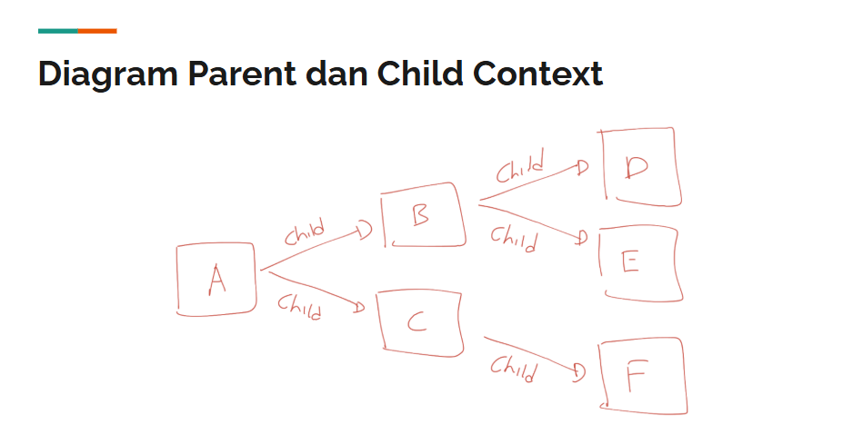

# Golang Context

---
## Pengenalan Context
- Context merupakan sebuah data yg membawa **value**, **sinyal cancel**, **sinyal timeout**, ,dan **sinyal deadline**.
- Context biasanya **dibuat per request** (misal setiap ad request masuk ke server web melalui http request)
- Context digunakan untuk mempermudah kita **meneruskan** value, dan sinyal **antar proses**.

### Kenapa Perlu?
- Context di Golang biasa digunakan untuk **mengirimkan data** request / sinyal **ke proses lain**.
- Dengan menggunakan context, ketika kita **ingin membatalkan semua proses**, kita **cukup mengirim sinyal ke context**, maka secara otomatis semua proses akan **dibatalkan**.
- Hampir semua bagian di Golang memanfaatkan context, seperti **database**, **http server**, **http client**, dan lain - lain.
- Bahkan di Google sendiri, ketika menggunakan Golang, context **wajib digunakan dan selalu dikirim** ke setiap function yang dikirim.


### Cara Kerja Context


### Interface Context
```go
type Context interface {
	Deadline() (deadline time.Time, ok bool)
	Done() <-chan struct{}
	Err() error
	Value(key interface{}) interface{}
}
```

---

## Membuat Context
- Karena Context adalah sebuah interface, untuk membuat context kita perlu sebuah struct yang sesuai dengan kontrak interface Context.
- Namun kita tidak perlu membuatnya secara manual.
- Di Golang package context, terdapat function yg bisa kita gunakan untuk membuat Context.

### Function Membuat Context
| Function | Keterangan|
| -------- | --------- |
| **context.Background()** | Membuat context kosong. Tidak pernah dibatalkan, tidak pernah timeout, dan tidak memiliki value apapun. **Biasanya digunakan di main function** atau dalam **test**, atau dalam **awal proses request terjadi**. |
| **context.TODO()** | Membuat context kosong seperti Background(), **namun biasanya** menggunakan ini **ketika belum jelas** context apa yang **ingin digunakan**. |

---

## Parent dan Child Context
- Context menganut konsep **parent** dan **child**
- Artinya, saat kita membuat context, kita bisa **membuat child context dari** context **yg sudah ada**.
- Parent context bisa **memiliki banyak child**, namun child hanya bisa **memiliki 1 parent context**.
- Konsep ini mirip dengan pewarisan di pemrograman berorientasi object.

### Diagram Parent dan Child Context


### Hubungan Antara Parent dan Child
- Parent dan Child context akan **selalu terhubung**.
- Saat nanti kita melakukan misal **pembatalan** context A, maka **semua child dan sub child** dari context A akan **ikut dibatalkan**.
- Namun jika misal kita **membatalkan context B**, hanya **context B** dan **semua child dan sub child-nya** yang **dibatalkan**, **parent** context B **tidak akan ikut dibatalkan**.
- Begitu juga nanti saat kita **menyisipkan data** ke dalam **context A**, **semua child dan sub child-nya** bisa **mendapatkan data** tersebut.
- Namun jika kita **menyisipkan data di context B**, hanya **context B** dan **semua child dan sub child-nya** yang mendapatkan data, **parent context B tidak akan mendapatkan data**.

### Immutable
- Context merupakan object yang **Immutable**, artinya **setelah** Context dibuat, dia **tidak bisa diubah lagi**.
- Ketika kita **menambahkan value** ke dalam context, atau **menambahkan pengaturan** _timeout_ dan yg lainnya, secara **otomatis** akan **membentuk child context baru**, **bukan merubah** context tersebut.

---

## Context with Value
- Pada saat awal membuat context, context tidak memiliki value.
- Kita bisa menambahkan sebuah value dengan data `Pair` (key-value) ke dalam context.
- Saat kita menambah value ke context, secara **otomatis akan tercipta** child context baru, artinya original context-nya **tidak akan berubah sama sekali**.
- Untuk membuat / menambahkan value ke context, kita bisa menggunakan function `context.WithValue(parent, key, value)`.

---

## Context with Cancel
- Selain menambahkan value ke context, kita juga bisa **menambahkan sinyal cancel** ke context.
- Kapan sinyal cancel diperlukan dalam context?
- Biasanya ketika **kita butuh menjalankan proses lain**, dan kita **ingin bisa memberi sinyal cancel** ke proses tersebut.
- Biasanya proses ini berupa **Goroutine yang berbeda**, sehingga dengan **mudah** jika kita **ingin membatalkan eksekusi Goroutine**, kita bisa **mengirim sinyal cancel** ke **context-nya**.
- Namun ingat, **Goroutine yang menggunakan context**, tetap harus **melakukan pengecekan terhadap context-nya**, jika tidak tidak ada gunanya.
- Untuk membuat context dengna cancel sinyal, kita bisa menggunakan function `context.WithCancel(parent)`.