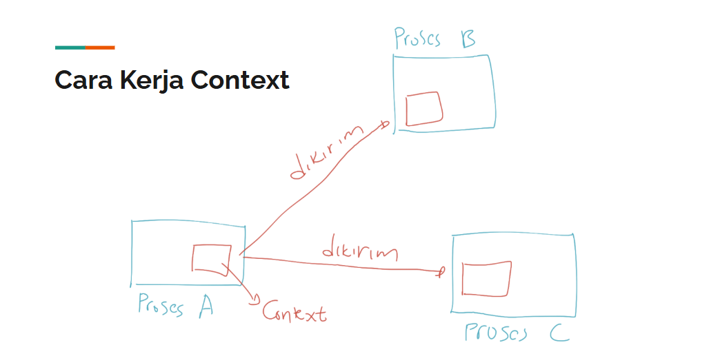

# Golang Context

---
## Pengenalan Context
- Context merupakan sebuah data yg membawa **value**, **sinyal cancel**, **sinyal timeout**, ,dan **sinyal deadline**.
- Context biasanya **dibuat per request** (misal setiap ad request masuk ke server web melalui http request)
- Context digunakan untuk mempermudah kita **meneruskan** value, dan sinyal **antar proses**.

### Kenapa Perlu?
- Context di Golang biasa digunakan untuk **mengirimkan data** request / sinyal **ke proses lain**.
- Dengan menggunakan context, ketika kita **ingin membatalkan semua proses**, kita **cukup mengirim sinyal ke context**, maka secara otomatis semua proses akan **dibatalkan**.
- Hampir semua bagian di Golang memanfaatkan context, seperti **database**, **http server**, **http client**, dan lain - lain.
- Bahkan di Google sendiri, ketika menggunakan Golang, context **wajib digunakan dan selalu dikirim** ke setiap function yang dikirim.


### Cara Kerja Context


### Interface Context
```go
type Context interface {
	Deadline() (deadline time.Time, ok bool)
	Done() <-chan struct{}
	Err() error
	Value(key interface{}) interface{}
}
```

---

## Membuat Context
- Karena Context adalah sebuah interface, untuk membuat context kita perlu sebuah struct yang sesuai dengan kontrak interface Context.
- Namun kita tidak perlu membuatnya secara manual.
- Di Golang package context, terdapat function yg bisa kita gunakan untuk membuat Context.

### Function Membuat Context
| Function | Keterangan|
| -------- | --------- |
| **context.Background()** | Membuat context kosong. Tidak pernah dibatalkan, tidak pernah timeout, dan tidak memiliki value apapun. **Biasanya digunakan di main function** atau dalam **test**, atau dalam **awal proses request terjadi**. |
| **context.TODO()** | Membuat context kosong seperti Background(), **namun biasanya** menggunakan ini **ketika belum jelas** context apa yang **ingin digunakan**. |
