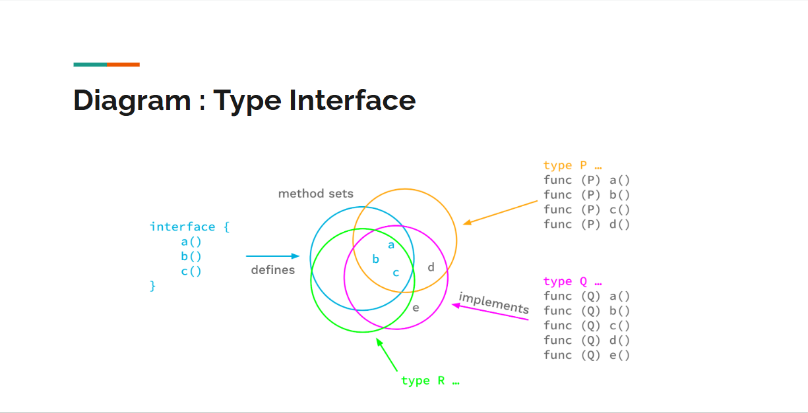
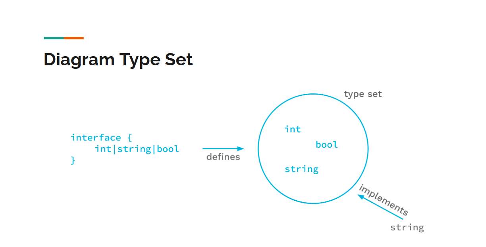

# Golang Generics

## Introduction

- Generic adalah kemampuan menambahkan parameter type saat membuat function.
- Berbeda dengan tipe data pada umumnya, generic dapat mengubah-ubah bentuk tipe data sesuai dengan yang kita mau.
- Fitur generics baru ada sejak Golang v1.18

### Manfaat

- **Pengecekan** ketika proses **kompilasi**
- **Tidak perlu manual** menggunakan **pengecekan tipe data** dan **konversi tipe** data.
- Memudahkan programmer membuat kode program yg generic sehingga bisa digunakan oleh berbagai tipe data.

---

## Type Parameter

- Untuk menandai sebuah function merupakan tipe generic, kita perlu menambahkan Type Parameter pada function tsb.
- Pembuatan Type Parameter menggunakna tanda **[] (kurung kotak)**, dimana **di dalam kurung kotak** tersebut, kita **tentukan nama** type Parameter-nya.
- Hampir sama dgn di bahasa pemrograman lain seperti Java, C#, dll, biasanya nama Type Parameter **hanya menggunakan 1 hurus**, misal T, K, V, dan lain-lain. Walaupun bisa saja lebih dari 1 huruf.

### Kode: Type Parameter

```go
func Length[T]() {

}
```

### Type Constraint

- Di bahasa pemrograman seperti Java, C#, Type Parameter biasanya tidak perlu kita tentukan tipe datanya, **berbeda** dgn di Golang.
- Di Golang, Type Parameter **wajib memiliki constraint**
- Type Constraint merupakan aturan yg digunakan untuk **menentukan tipe data yang diperbolehkan** pada Type Parameter.
- Contoh, jika kita ingin Type Parameter **bisa digunakan untuk semua tipe data**, kita bisa gunakan `interface{}` (kosong) sbg constraintnya.
- Type Constraint yg lebih detaul akan dibahas di materi **Type Sets**.

### Type Data any

- Di Golang 1.18, diperkenalkan **alias baru** bernama `any` untuk `interface{}`, ini bisa mempermudah kita ketika membuat Type Parameter dengan constraint `interface{}`, jadi kita cukup gunakan constraint `any`.

### Menggunakan Type Parameter

- Setelah kita buat Type Parameter di function, selanjutnya kita **bisa menggunakan** Type Parameter tsb sbg tipe data **di dalam function tsb**.
- Misalnya digunakan untuk return type atau function parameter.
- Kita cukup gunakan nama Type Parameternya saja.
- Type Parameter **hanya bisa digunakan di function saja**, tidak bisa digunakan di luar function.

---

## Multiple Type Parameter

- Penggunaan Type Parameter bisa lebih dari 1, cukup gunakan tanda **, (koma)** sbg pemisah.
- Nama Type Parameter **harus berbeda**, tidak boleh sama jika kita menambahkan Type Parameter lebih dari 1.

### Kode: Multiple Type Parameter

```go
func MultipleParameter[T1 any, T2 any](param1 T1, param2 T2) {
	fmt.Println(param1)
	fmt.Println(param2)
}
```

---

## Comparable

- Selain `any` di Golang 1.18, juga **terdapat tide data** bernama `comparable`
- `comparable` merupakan **interface yg diimplementasikan** oleh tipe data yang bisa dibandingkan (menggunakan operator **!=** dan **==**), seperti:

  - Booleans
  - Numbers
  - Strings
  - Pointers
  - Channels
  - Interfaces
  - Array

  yang isinya ada **comparable type**, atau `structs` yang **fieldsnya** adalah **comparable type**.

### Kode: Comparable

```go
func IsSame[T comparable](val1, val2 T) bool {
	if val1 == val2 {
		return true
    } else {
	    return false
    }
}

func TestIsSame(t *testing.T) {
	assert.Equal(t, true, IsSame[string]("nathan", "nathan"))
	assert.Equal(t, true, IsSame[int](100, 100))
}
```

---

## Type Parameter Inheritance

- Golang sendiri **tidak memiliki pewarisan**, namun seperti kita ketahui, jika kita membuat sebuah type yang **sesuai dengan kontrak interface**, maka dianggal sbg **implementasi interface tsb**.
- Type Parameter juga **mendukung hal serupa**, kita bisa gunakan constraint dengan menggunakan `interface`, maka secara otomatis **semua interface** yang **compatible** dengan type constraint tsb bisa kita gunakan.

### Diagram



## Kode: Employee Interface

```go
type Employee interface {
	GetName() string
}

func GetName[T Employee](parameter T) string {
	return parameter.GetName()
}
```

## Kode: Manager Interface

```go
type Manager interface {
	GetName() string
	GetManagerName() string
}

type MyManager struct {
	Name string
}

func (m *MyManager) GetName() string {
	return m.Name
}

func (m *MyManager) GetManagerName() string {
	return m.Name
}
```

### Kode: Vice President Interface

```go
type VicePresident interface {
	GetName() string
	GetVicePresidentName() string
}

type MyVicePresident struct {
	Name string
}

func (m *MyVicePresident) GetName() string {
	return m.Name
}

func (m *MyVicePresident) GetVicePresidentName() string {
	return m.Name
}
```

---

## Type Sets

- Salah satu fitur yang menarik di Golang Generic adalah **Type Sets**
- Dengan fitur ini, kita **bisa menentukan lebih dari 1** tipe constraint **yang diperbolehkan** pada Type Parameter.

### Membuat Type Set

- Type Set adalah **sebuah** `interface`
- Cara membuat Type Set:
- ```go
  type NamaTypeSet interface {
    P | Q | R
  }
  ```
- Type Set **hanya bisa digunakan pada Type Parameter**, tidak bisa digunakan sbg tipe data field / variable.
- Jika **operator bisa digunakan di semua tipe data di dalam Type Set**, maka operator tsb **bisa digunakan dalam kode generic**.

### Diagram Type Set



### Kode: Type Set Interface

```go
type Number interface {
    int | int8 | int16 | int32 | int64 | float32 | float64
}

func Min[T Number](first T, second T) T {
    if first < second {
        return firstf
    } else {
        return second
    }
}
```

---

## Type Approximation

- Kadang, kita sering membuat **Type Declaration** di Golang untuk **tipe data lain**, misal kita membuat tipe data `Age` untuk `int`.
- Secara **default**, jika kita gunakan `Age` sbg type declaration untuk `int`, lalu kita **membuat Type Set** yang **berisi constraint** `int`, maka tipe data `Age` **dianggap tidak compatible** dengan Type Set yang kita buat.

### Kode: Type Declaration

```go
type Age int

type Number interface {
	int | int8 | int16 | int32 | int64 | float32 | float63
}
```

### Kode: Test Type Declaration

```go
func TestTypeSets(t *testing.T) {
	assert.Equal(t, int(100), Min[int](100, 200))
	assert.Equal(t, int64(100), Min[int64](100, 200))
	assert.Equal(t, float64(100), Min[float64](100.0, 200.0))
	assert.Equal(t, Age(100), Min[Age](Age(100), Age(100)) // Error
}
```

- Untungnya, di Golang memiliki feature bernama **Type Approximation**, dimana kita bisa menyebutkan bahwa **semua constraint** dengan tipe **tersebut** dan juga yang **memiliki tipe dasarnya** adalah tipe tersebut, maka **bisa digunakan**
- Untuk menggunakan Type Approximation, kita bisa gunakan tanda **~ (tilde)**

### Kode: Type Approximation

```go
type Age int

type Number interface {
	~int | int8 | int16 | int32 | int64 | float32 | float63
}
```

---

## Type Inference

- Type Inference merupakan fitur dimana kita **tidak perlu menyebutkan Type Parameter ketika memanggil kode Generic**
- Tipe data Type Parameter **bisa dibaca secara otomatis** misal **dari parameter yang kita kirim**
- Namun perlu diingat, **pada beberapa kasus**, jika **terjadi error** karena Type Inference, kita bisa **dengan mudah memperbaikinya** dengan **cara menyebutkan Type Parameternya saja**.

### Kode: Type Inference

```go
func TestTypeInference(t *testing.T) {
    assert.Equal(t, int(100), Min(100, 200))
    assert.Equal(t, int64(100), Min(int64(100), int64(200)))
    assert.Equal(t, float64(100), Min(100.0, 200.0))
    assert.Equal(t, Age(100), Min(Age(100), Age(200)))
}
```

---

## Generic Type

- Generic **bisa digunakan** juga ketika **membuat Type**

### Kode: Generic Type

```go
type Bag[T any] []T

func PrintBag[T any] (bag Bag[T]) {
    for _, val := range bag {
        fmt.Println(val)
    }
}
```

---

## Generic Struct

- Struct juga mendukun Generic
- Dengan menggunakan generic, kita **bisa membuat Field** dengan tipe data **yang sesuai dengan Type Parameter**

### Kode: Generic Struct

```go
type Data[T any] struct {
	First T
	Second T
}

func TestData(t *testing.T) {
    data := Data[string] {
        First: "Nathan",
		Second: "Garzya",
    }
	fmt.Println(data)
}
```

### Generic Method

- Selain di function, kita juga bisa tambahkan generic di **method (function di struct)**.
- Namun, Generic di method **merupakan Generic yang terdapat di struct-nya**.
- Kita **wajib menyebutkan** semua Type Parameter yang terdapat di struct, walaupun **tidak kita gunakan**, misalnya atau jika **tidak ingin gunakan**, kita bisa gunakan **\_ (garis bawah)** sebagai pengganti Type Parameternya.
- Method **tidak bisa memiliki** Type Parameter **yang mirip** dengan di function.

### Kode: Generic Method

```go
func (d *Data[_]) SayHello(name string) string {
    return "Hello " + name
}

func (d *Data[T]) ChangeFirst(first T) T {
    d.First = first
    return first
}
```

---

## Generic Interface

- Generic juga bisa digunakan di interface.
- Secara otomatis, **semua struct** yang ingin mengikuti **kontrak interface** tsb **harus menggunakan generic semua**.

### Kode: Generic Interface

```go
func GetterSetter[T any] interface {
    GetValue() T
    SetValue(value T)
}

func ChangeValue[T any](param GetterSetter[T], value T) T {
    param.SetValue(value)
    return param.GetValue()
}
```

### Kode: Implementasi Struct

```go
type MyData[T any] struct {
    Value T
}

func (m *MyData[T]) GetValue() T {
    return m.Value
}

func (m *MyData[T]) SetValue(value T) {
    m.Value = value
}
```

### Kode: Test Generic Interfacw

```go
func TestInterface(t *testing.T) {
    myData := MyData[string]{}
    result := ChangeValue[string](&myData, "Nathan")

    assert.Equal(t, "Nathan", result)
}
```

---

## In Line Type Constraint

- Sebelumnya, kita selalu menggunakan **Type Declaration** atau **Type Set** ketika membuat Type Constraint di type parameter.
- Sebenarnya **tidak ada kewajiban** kita harus membuat type declaration atau type set **jika** kita ingin membuat Type Parameter, kita bisa **gunakan secara langsung (in line)** pada Type Constraint, misalnya di awal kita sudah bahas tentang `interface{}` (kosong), tapi kita selalu gunakan type declaration `any`.
- Jika kita mau, kita juga bisa langsung gunakan `interface{int | float32 | float64}` dibanding membuat Type Set Number **misalnya**.

### Kode: In Line Type Constraint

```go
func FindMin[T interface{ int | int64 | float64}](first T second T) T {
    if first < second {
        return first
    } else {
        return second
    }
}

func TestFindMin(t *testing.T) {
    assert.Equal(t, 100, FindMin(100, 200))
    assert.Equal(t, int64(100), FindMin(int64(100), int64(200)))
    assert.Equal(t, 100.0, FindMin(100.0, 200.0))
}
```

### Generic di Type Parameter

- Pada kasus tertentu, **kadang ada kebutuhan** kita **menggunakan Type Parameter** yang ternyata Type tersebut juga **generic / memiliki Type Parameter**.
- Kita juga bisa menggunakan **in line type constraint** agar lebih mudah, dengan cara **menambahkan type parameter selanjutnya**, misal
  - `[S interface{[]E}, E interface{}]`, artinya **S harus slice element E**, dimana **E boleh tipe apapun**.
  - `[S []E, E any]`, artinya **S harus slice element E**, dimana **E boleh tipe apapun**.

#### Kode: Generic di Type Parameter

```go
func GetFirst[T []E, E any](data T) E {
    first := data[0]
    return first
}

func TestGetFirst(t *testing.T) {
    names := []string{
        "Nathan",
        "Garzya",
        "Santoso",
    }

    first := GetFirst[[]string, string](names)
    assert.Equal(t, "Nathan", first)
}
```

---

## Experimental Package

- Terdapat Experimental Package yang benyak menggunakan fitur Generic namnun belum resmi masuk ke Golang Standard Library.

### Kode: Experimental Constraints

```go
func ExperimentalMin[T constraints.Ordered](first T, second T) T {
    if first < second {
        return first
    } else {
        return second
    }
}
```

### Maps & Slices Package

- Terdapat juga package maps dan slices, yang berisi function untuk mengelola data `Map` dan `Slice`, namun sudah menggunakan **fitur Generic**.

#### Kode: Experimental Maps

```go
func TestExperimentalMaps(t *testing.T) {
    first := map[string]string{
        "Name": "Nathan",
    }

    second := map[string]string{
        "Name": "Nathan",
    }

    assert.True(t, maps.Equal(first, second))
}
```

#### Kode: Experimental Slices

```go
func TestExperimentalSlices(t *testing.T) {
    first := []string{"Nathan"}
    second := []string{"Nathan"}

    assert.True(t, slices.Equal(first, second))
}

```
