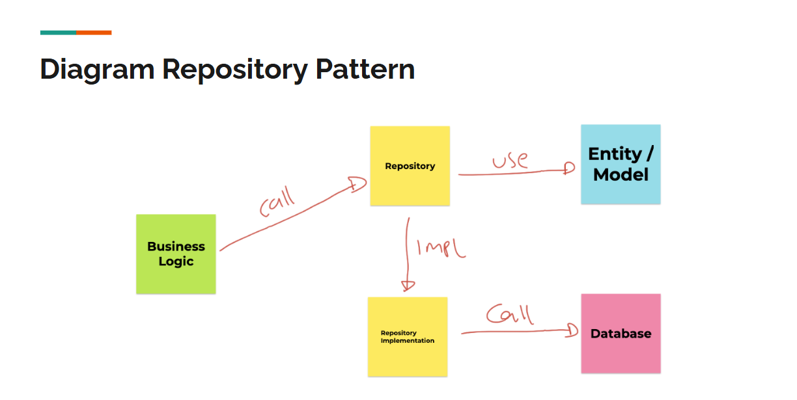

# Golang Object Relational Mapping

## Pengenalan GORM

- ORM atau Object Relational Mapping adalah teknik untuk memetakan data dari database relational ke dalam object dalam pemrograman.
- Ketika kita belajar Golang Database, kita belajar pattern bernama **Repository**, yang digunakan sbg jembatan komunikasi ke Database.
- Saat meembuat Repository, kita membuat struct `Entity` sebagai **representasi** dari **table** di database.
- Hal itu sebenarnya sudah bisa dibilang sebuah `ORM`, namun masih dilakukan secara **manual**.

### Diagram Repository Pattern



### GORM

- GORM adalah salah satu library untuk implementasi ORM secara otomatis di Golang.
- Dengan menggunakan GORM, kita bisa fokus membuat pemetaan struct `Entity`, **tanpa harus memikirkan** detail dari implementasi `SQL` yang harus kita buat **untuk memanipulasi datanya**.
- GORM juga **mendukung relasi** antar `Entity` atau `Table`, baik **One to One**, **One to Many**, sampai **Many to Many**
- [https://gorm.io](https://gorm.io)

---

## Database Connection

- Untuk membuat koneksi ke database, kita bisa menggunakan `gorm.Open()`.
- **Tiap database** memiliki `config` masing-masing, kita bisa lihat semua config di database pada halaman: [https://gorm.io/docs/connecting_to_the_database.html](https://gorm.io/docs/connecting_to_the_database.html)

### Kode: Database Connection

```go

import (
    "gorm.io/driver/mysql"
    "gorm.io/gorm"
)

func OpenConnection() *gorm.DB {
    dialect := mysql.Open("root:@tcp(127.0.0.1:3306)/belajar_golang_gorm?charset=utfmb4&parseTime=True&loc=Local")

    db, err := gorm.Open(dialect, &gorm.Config{})
    if err != nil {
        panic(err)
    }

    return db
}
```

### Kode: Test Database Connection

```go
var db = OpenConnection()

func TestConnection(t *testing.T) {
    assert.NotNil(t, db)
}
```

---

## Raw SQL

- Raw SQL artinya membuat query SQL secara manual.
- Terdapat **2 jenis** SQL, untuk melakukan Query (Select) atau untuk mengubah data (Insert, Update, Delete).
- Untuk melakukan query, kita bisa menggunakan method `Raw(sql)` di `gorm.DB`.
- Dan untuk melakukan manipulasi data, kita bisa gunakan method `Exec(sql)` di `gorm.DB`.

### Kode: Table Sample

```sql
create table sample (
    id varchar(100) not null,
    name varchar(100) not null,
    primary key (id)
) engine = InnoDB
```

### Kode: Execute SQL

```go
func TestExecuteSQL(t *testing.T) {
    err := db.Exec("insert into sample(id, name) values (?, ?)", "1", "nathan").Error

    assert.Nil(t, err)

    err = db.Exec("insert into sample(id, name) values (?, ?)", "2", "garzya").Error

    assert.Nil(t, err)

    err = db.Exec("insert into sample(id, name) values (?, ?)", "3", "santoso").Error

    assert.Nil(t, err)

    err = db.Exec("insert into sample(id, name) values (?, ?)", "4", "canonflow").Error

    assert.Nil(t, err)
}
```

### Kode: Query SQL

```go

type Sample struct {
    ID string
    Name string
}

func TestRawSQL(t *testing.T) {
    var sample Sampel

    err := db.Raw("select id, name from sample where id = ?", "1").Scan(&sample).Error

    assert.Nil(t, err)
    assert.Equal(t, "1", sample.ID)

    var samples []Sample
    err = db.Raw("select id, name from sample").Scan(&samples).Error

    assert.Nil(t, err)
    assert.Equal(t, 4, len(samples))
}
```

### `sql.Row` & `sql.Rows`

- GORM sendiri sebenarnya didalamnya tetap menggunakan package `sql` bawaan dari Golang.
- Jika kita ingin mendapatkan hasil query dalam bentuk `sql.Rows`, kita bisa menggunakan method `Rows()` setelah melakukan query.

### Kode: `sql.Row`

```go
func TestSQLRow(t *testing.T) {
    var samples []Sample

    rows, err := db.Raw("select id, name from sample").Rows()
    assert.Nil(t, err)
    defer rows.Close()

    for rows.Next() {
        var id string
        var name string

        err := rows.Scan(&id, &name)
        assert.Nil(t, err)

        samples = append(samples, Sample{
            ID: id,
            Name: name
        })
    }

    assert.Equal(t, 4, len(samples))
}
```

### Kode: `gorm.DB.ScanRows()`

```go
func TestScanRows(t *testing.T) {
    var samples []Sample

    rows, err := db.Raw("select id, name from sample").Rows()
    assert.Nil(t, err)
    defer rows.Close()

    for rows.Next() {
        err := db.ScanRows(rows, &samples)
        assert.Nil(t, err)
    }

    assert.Equal(t, 4, len(sample))
}
```

---

## Model

- Model atau Entity adalah `Struct` **representasi** dari table di database.
- Saat kita membuat tabel di database, direkomendasikan dibuatkan struct representasinya.
- Hal ini agar kita **tidak perlu** melakukan pembuatan perintah SQL **secara manual lagi**.

### Kode: Tabel User

```sql
create table users (
    id varchar(100) not null,
    password varchar(100) not null,
    name varchar(100) not null,
    created_at timestamp not null default current_timestamp,
    updated_at timestamp not null default current_timestamp on update current_timestamp,
    primary key (id)
) engine = InnoDB
```

### Kode: User Entity

```go
import "time"

type User struct {
    ID string
    Password string
    Name string
    CreatedAt time.Time
    UpdatedAt time.Time
}
```

### Convention

- Saat kita membuat struct, **secara default** GORM akan melakukan **mapping secara otomatis**, dimana:
  - **nama tabel** akan dipilih dari **nama struc**t menggunakan **lower_case jamak**.
  - **nama kolom** akan dipilih menggunakan **lower_case**.
- Selain itu, **secara otomatis** GORM akan memilih **field ID** sebagai **Primary Key**.
- Namun, sebenarnya **disarankan** kita **deklarasi secara manual** menggunakan `tag` dibanding secara otomatis.
- [https://gorm.io/docs/models.html#Fields-Tags](https://gorm.io/docs/models.html#Fields-Tags)

### Kode: User Entity dengan Tag

```go
type User struct {
    ID string `gorm:"primaryKey;column:id"`
    Password string `gorm:"column:password"`
    Name string `gorm:"name"`
    CreatedAt time.Time `gorm:"created_at;autoCreateTime"`
    UpdatedAt time.Time `gorm:"updated_at;autoCreateTime;autoUpdateTime"`
}
```

### Table Name

- Secara default, nama table akan menggunakan **lower_case** dan **jamak**.
- Misal struct `User` akan menggunakan table `users`.
- Misal struct `OrderDetail` akan menggunakan table `order_details`.
- Namun, jika kita ingin menggunakan manual nama tabel-nya, kita bisa menggunakan **interface Tabler**, yang **mewajibkan** membuat **method** dengan nama `TableName()`.

### Kode: User Entity

```go
type User struct {
    ID string `gorm:"primaryKey;column:id"`
    Password string `gorm:"column:password"`
    Name string `gorm:"name"`
    CreatedAt time.Time `gorm:"created_at;autoCreateTime"`
    UpdatedAt time.Time `gorm:"updated_at;autoCreateTime;autoUpdateTime"`
}

func (u *User) TableName() string {
    return "users"
}
```
